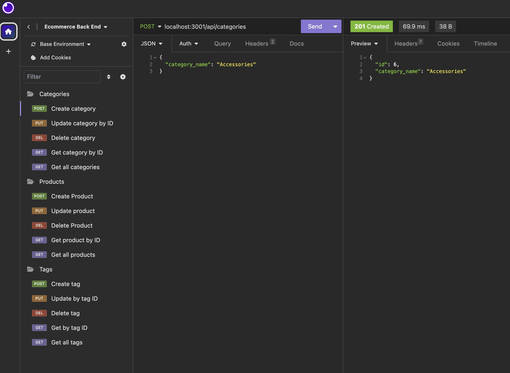

  # ORM E-Commerce Back End
  
  ## Description
  This E-Commerce back end wals through how to use insomnia to check api routes when kepping track of, deleting, and updating products.
  
## Table of Contents
1. [Installation](#installation)
2. [Usage](#usage)
3. [License](#license)
4. [Contributing](#contributing)
5. [Images](#images)
6. [Questions](#questions)

  ## Installation
  To use this on your local computer, clone the repository down from GitHub. Youll want to create a .env file and include DB_NAME (the database name), DB_ROOT (root), and DB_PASSWORD (your MySQL password). Additionally, you will want to run npm install to install the required node modules. Source the database by running MySQL, then SOURCE db/schema.sql in the integrated command line. Exit MySQL and source the seeds by running npm run seed. Enter npm start in the command line, and head over to insomnia to test your routes!
  
  ## Usage
  With this application, you can view, update, create, and delete for all products, categories, and tags.
  
  ## Contributing
  Source code provided by bootcamp instructors (server files, seed files, file structure). Insomnia.
  
  ## Images
  

  ## Video Demonstration
  [Watch tutorial here](https://drive.google.com/file/d/1WdXUgI6A0-Rhv1mBBOKH_B_pOH7VJqtJ/view)
  
  ## Questions
If you have any questions, please feel free to reach out to me at [peytonengborg@gmail.com](mailto:peytonengborg@gmail.com).To see more of my work, check out my [GitHub](https://github.com/phechzzz) page.
